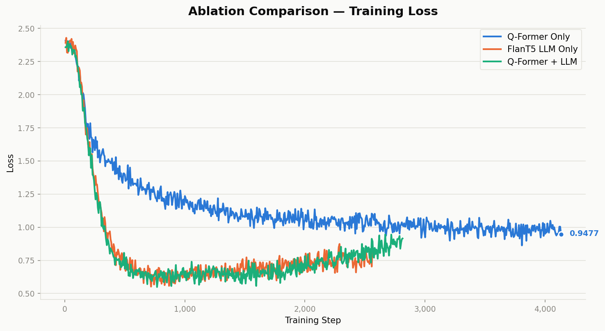

# NutriVision

Food image understanding and nutrition estimation with BLIP-2 and LoRA fine-tuning.

Given a photo of a plate of food, NutriVision:

1. **Describes** the dish (captioning)
2. **Lists the ingredients**
3. **Estimates total calories**
4. **Estimates macronutrients** (protein, fat, carbohydrates in grams)
5. **Answers dietary questions** (VQA), e.g. *"Is this dish suitable for a low-carb diet?"*

The project compares two zero-shot BLIP-2 variants, fine-tunes the stronger one with LoRA in a three-way ablation (Q-Former only, LLM only, both), and adds a rule-based post-filter that catches hallucinations and inconsistent answers.

## Approach

| Stage | What happens |
|---|---|
| Zero-shot baseline | BLIP-2 + OPT-2.7B vs BLIP-2 + Flan-T5-XL, evaluated without any training |
| LoRA fine-tuning | Flan-T5-XL variant fine-tuned on Nutrition5K (r=16, α=32, 3 epochs, effective batch 32). Ablation over where the adapters go: `qformer`, `llm`, `both` |
| Generalisation test | Training uses 12 VQA question templates; 8 further templates are held out and only seen at test time |
| Post-filter | Removes non-food ingredients, flags out-of-range values, checks Atwater consistency (calories vs macros) and cross-task consistency, and corrects VQA answers that contradict the model's own numeric estimates |
| Demo | Gradio app to upload an image and see all five tasks, raw vs post-filtered |

## Results

Test set: 507 Nutrition5K dishes. Means with 95% bootstrap confidence intervals are in each run's `summary_metrics.csv`.

### Zero-shot model selection

| Metric | OPT-2.7B | Flan-T5-XL |
|---|---|---|
| Captioning ROUGE-1 | 0.379 | **0.427** |
| Ingredient F1 | **0.384** | 0.290 |
| Calorie MAE (kcal) | 244.7 | **152.8** |
| VQA yes/no accuracy (%) | 56.5 | **58.3** |

Flan-T5-XL was chosen for fine-tuning (instruction-tuned, better calorie estimates and captions). Full table: [`results/model_comparison.csv`](results/model_comparison.csv).

### Fine-tuning ablation (Flan-T5-XL)

| Metric | Zero-shot | Q-Former LoRA | LLM LoRA | Both LoRA |
|---|---|---|---|---|
| Captioning BLEU-1 | 0.280 | **0.630** | 0.585 | 0.590 |
| Captioning METEOR | 0.309 | **0.657** | 0.629 | 0.626 |
| Ingredient F1 | 0.290 | **0.655** | 0.560 | 0.577 |
| Calorie MAE (kcal) | 152.8 | **92.5** | 111.1 | 99.4 |
| Protein MAE (g) | 17.7 | 18.6 | 13.6 | **11.5** |
| Fat MAE (g) | 13.4 | **7.1** | 11.1 | 9.2 |
| Carb MAE (g) | 20.7 | **12.6** | 16.3 | 15.9 |
| VQA seen accuracy (%) | — | 74.7 | 80.7 | **83.7** |
| VQA unseen accuracy (%) | — | 58.6 | **64.8** | 60.7 |

### Effect of the post-filter on VQA accuracy (%)

| Config | Raw | Post-filtered |
|---|---|---|
| Zero-shot | 58.3 | 76.6 |
| Q-Former LoRA — unseen questions | 58.6 | 77.1 |
| LLM LoRA — unseen questions | 64.8 | 81.0 |
| Both LoRA — unseen questions | 60.7 | 80.3 |
| Both LoRA — overall | 70.6 | **81.7** |

Full table: [`results/post_filter_comparison.csv`](results/post_filter_comparison.csv). Interactive version: [`results/post_filter_comparison.html`](results/post_filter_comparison.html).



## Repository structure

```
src/
  config.py                 Paths, model names, prompts, VQA templates, generation settings
  data_prep/
    create_splits.py        Train/test split from the official Nutrition5K splits
    metadata_parser.py      Reads Nutrition5K dish metadata CSVs
    prepare_training_data.py  Builds prompt/answer pairs for fine-tuning
  train/
    lora_finetune.py        LoRA fine-tuning (--target qformer | llm | both)
    plot_training.py        Loss curves and LR schedule plots
  eval/
    zero_shot_inference.py  Zero-shot inference (OPT or Flan-T5-XL)
    finetuned_inference.py  Inference with a LoRA adapter
    ground_truth.py         Builds the answer key from Nutrition5K metadata
    evaluate.py             BLEU / ROUGE / METEOR, ingredient P/R/F1, MAE/MAPE, VQA accuracy
    post_filter.py          Hallucination and consistency post-filter
    compare_models.py       Zero-shot OPT vs Flan-T5 table
    compare_ablation.py     Baseline vs fine-tuned table
    compare_post_filter.py  Raw vs post-filtered table and HTML dashboard
  demo/
    demo_app.py             Gradio demo
results/                    Model outputs, metrics, comparison tables and plots
logs/                       Console logs from every run, numbered in execution order
```

Files prefixed `v2_` are the final runs: sentence-level VQA answers and the seen/unseen question split. Unprefixed fine-tuning files are from the first iteration and are kept for reference.

## Setup

Requires Python 3.12 and a CUDA GPU (experiments were run on a single GPU; BLIP-2 Flan-T5-XL is loaded in float16).

```bash
git clone https://github.com/hpriya03/nutrivision.git
cd nutrivision
pip install -r requirements.txt
```

### Data

The [Nutrition5K dataset](https://github.com/google-research-datasets/Nutrition5k) is not included. Download it and arrange it as:

```
data/
  raw/
    metadata/               dish_metadata_cafe1.csv, dish_metadata_cafe2.csv
    realsense_overhead/     one folder per dish with rgb.png
  official_splits/          official RGB train/test split files
```

`data/` and `checkpoints/` are excluded from git.

## Running the pipeline

Run all commands from the repository root. The numbers match the files in `logs/`.

```bash
# 1–2. Splits
python src/data_prep/create_splits.py

# 3–6. Zero-shot inference (add --test-run for a 5-dish sanity check)
python -m src.eval.zero_shot_inference --model opt
python -m src.eval.zero_shot_inference --model flan-t5-xl

# 7. Ground truth
python -m src.eval.ground_truth

# 8–10. Evaluate and compare zero-shot models
python -m src.eval.evaluate --results-dir results/zero_shot_opt --ground-truth results/ground_truth.json
python -m src.eval.evaluate --results-dir results/zero_shot_flan-t5-xl --ground-truth results/ground_truth.json
python -m src.eval.compare_models

# 11. Training data
python -m src.data_prep.prepare_training_data

# 12. LoRA fine-tuning (ablation)
python -m src.train.lora_finetune --target qformer
python -m src.train.lora_finetune --target llm --lr 1e-4   # lower LR avoids float16 NaNs
python -m src.train.lora_finetune --target both

# 13. Training plots
python -m src.train.plot_training --runs qformer llm both

# 13–14. Fine-tuned inference and evaluation (repeat for llm and both)
python -m src.eval.finetuned_inference --target qformer
python -m src.eval.evaluate --results-dir results/v2_finetuned_qformer

# 15. Post-filter (repeat per results directory) and comparison
python -m src.eval.post_filter --results-dir results/v2_finetuned_qformer
python -m src.eval.compare_post_filter
```

## Demo

```bash
python -m src.demo.demo_app --target both          # or qformer | llm | zero-shot
python -m src.demo.demo_app --target both --share  # public Gradio link
```

The demo needs the LoRA checkpoints in `checkpoints/v2_lora_flan-t5-xl_{target}/best`.

## Acknowledgements

- [Nutrition5K](https://github.com/google-research-datasets/Nutrition5k) — Thames et al., CVPR 2021
- [BLIP-2](https://huggingface.co/Salesforce/blip2-flan-t5-xl) — Li et al., ICML 2023
- [LoRA](https://arxiv.org/abs/2106.09685) — Hu et al., ICLR 2022
